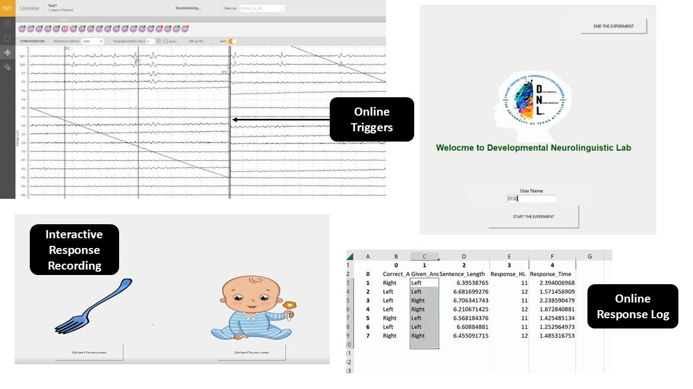

# mobile-eeg-stimulus-presenter
A Python-based stimulus presentation platform for mobile EEG research.
# Mobile EEG Stimulus Presentation Platform

A Python-based stimulus presentation platform engineered to facilitate mobile EEG research in non-laboratory settings. This system was designed to increase research accessibility, removing geographical barriers in scientific studies.


---

* **Dynamic Configuration**: Load all experimental parameters, stimuli paths, and trial logic directly from an external Excel file, allowing for easy setup of new experiments without changing the code.
* **Synchronized Presentation**: Delivers precisely timed and synchronized audio-visual stimuli for reliable data collection.
* **Hardware Integration Ready**: Includes a framework for sending real-time event markers (triggers) via TCP/IP sockets to synchronize with external EEG hardware.
* **Comprehensive Data Logging**: Captures and saves detailed behavioral data—including participant choice, accuracy, and reaction time—to a clean `.csv` file for each participant.
* **User-Friendly Interface**: A clean, fullscreen GUI built with Tkinter provides a consistent and immersive experience for participants.

---



## Project Setup

Follow these steps to get the experiment running on your local machine.

#### 1. Get the Code
   - On the GitHub repository page, click the green **`< > Code`** button.
   - Select **Download ZIP**.
   - Unzip the downloaded file to a location on your computer.

#### 2. Install Dependencies
   - This project requires a few external Python libraries. You can install them using pip:
   ```bash
   pip install pandas openpyxl playsound Pillow
   ```

#### 3. Create Required Folders
   - Inside the main project folder (`mobile-eeg-stimulus-presenter/`), create two new empty folders:
     - `Stimuli`
     - `data`

#### 4. Add Your Experiment Files
   - **Place all your media files** (e.g., `.wav`, `.png`, `.jpg`) inside the `Stimuli` folder.
   - **Place your `LENA_Modified.xlsx`** file in the main project folder.

#### 5. Configure System Paths
   - Open the **`config.py`** file in a text editor.
   - **You must update the placeholder paths** with the full, absolute paths to the folders and files on your computer.

   ```python
   # Example of a correctly filled-out config.py
   STIMULI_FOLDER = 'C:/Users/YourName/Documents/mobile-eeg-stimulus-presenter/Stimuli'
   STIMULI_INFO_FILE = 'C:/Users/YourName/Documents/mobile-eeg-stimulus-presenter/LENA_Modified.xlsx'
   DATA_SAVE_FOLDER = 'C:/Users/YourName/Documents/mobile-eeg-stimulus-presenter/data'
   ```

---

## How to Run the Experiment

Once the setup is complete, you can run the experiment from your terminal or command prompt.

1.  Navigate to the main project directory:
    ```bash
    cd path/to/your/mobile-eeg-stimulus-presenter
    ```
2.  Run the main Python script:
    ```bash
    python main.py
    ```

---

## The Stimuli Excel File

The `LENA_Modified.xlsx` file controls every aspect of the experiment. The first row must be a header with these exact column names:

| Column Name     | Description                                               | Example          |
| :-------------- | :-------------------------------------------------------- | :--------------- |
| `NFW`           | Filename of the first audio clip.                         | `Bebe_.wav`      |
| `FinalWord`     | Filename of the second audio clip.                        | `Bebe-07.wav`    |
| `LeftResponse`  | Filename of the image for the left choice.                | `tenedores.png`  |
| `RightResponse` | Filename of the image for the right choice.               | `bebe.png`       |
| `CorrectResponse` | The correct answer. Must be exactly `Left` or `Right`.  | `Right`          |
| `HLMarker`      | The numeric EEG trigger value for this trial.             | `1`              |
| `CorrectAudio`  | Filename of the audio for a correct answer.               | `YAY.wav`        |
| `Wrongaudio`    | Filename of the audio for an incorrect answer.            | `aww.wav`        |
| `CorrectImage`  | Filename of the image for a correct answer.               | `GreatJob.png`   |
| `Wrongimage`    | Filename of the image for an incorrect answer.            | `wrong.png`      |

---
